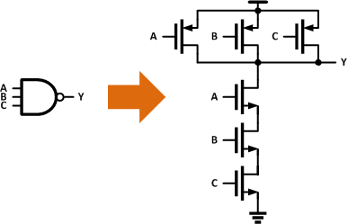
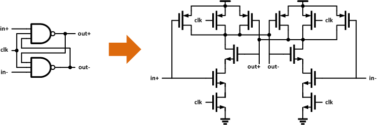
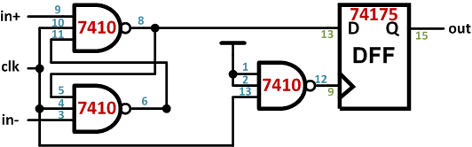

# An Analog Comparator Built Entirely out of 7410 Digital NAND3 Chips

## Theory

Every first-year EE student can tell you why the NAND gate is the most versatile. It can be used to generate any type of gate (AND/OR/XNOR, etc.) and has the best performance over its counterparts.

Little do they know, the NAND gate isn't just versatile in the digital world, it can even be used in the analog world. Let's take a closer look at the internal structure of the NAND3:

Nothing too special on its own, but what happens when you pair it precisely with another NAND3 gate in a feedback pattern similar to an SR latch?

You actually end up with a simple form of clocked analog [comparator](http://en.wikipedia.org/wiki/Comparator)! These devices[^1] (believe it or not) can actually be used to compare two analog values at the edge of a clock. Furthermore, 7410 chips usually have buffers at their inputs/outputs and for some models they are actually made from a combination of smaller 2-input gates. Even with these issues the comparator still functions (but it does have much larger hysteresis and a smaller dynamic range).

In order to compare continuously, this comparator needs to be followed by a latch or flip flop to keep the value of the last conversion as the comparator is being reset. This can again be made entirely out of NAND3 gates but for simplicity I used a 74175 quad FF chip.

## Measurement Results

In order to prove this theory I took a 7410 triple 3-input NAND chip and built the comparator circuit above. The final circuit I ended up testing is below.

The output value needs to be saved before the comparator is reset every cycle. Because the comparator resets at each negative clock edge I used the extra NAND3 gate as an inverter to drive the clock of a 74175 Flip-Flop, capturing the output of the comparator before reset.

With this configuration I tested the comparator at a couple different clock and input frequencies with a fixed comparison level of 2V DC.

|  |                                                               |                                                                                                           |                                                                                                                                                                                    |
| ---------------------------------------------------------------- | ------------------------------------------------------------------------------------------------------------------------ | -------------------------------------------------------------------------------------------------------------------------------------------------------------------- | --------------------------------------------------------------------------------------------------------------------------------------------------------------------------------------------------------------------------------------------- |
| [Comparator breadboard setup](assets/comp_setup.jpeg)            | [200kHz clock, 100kHz input sine wave, 46mA](assets/scope1.png)                                                          | [40MHz clock, 100kHz input sine wave, 61mA](assets/scope2.png)                                                                                                       | [40MHz clock, 4MHz input sine wave, 67mA](assets/scope3.png)                                                                                                                                                                                  |
| Test breadboard setup with 7410 and 74175 chips.                 | Under basic operating conditions (200kHz clock, 100kHz input) the comparator works very well. It draws about 46mA at 5V. | The maximum clock frequency I was able to get the comparator to operate correctly was just over 40MHz. Increasing the clock frequency increases the current to 61mA. | With the 40MHz clock, the highest input frequency that showed anything reasonable topped out at around 4MHz. which is pretty good compared to the bandwidth of popular analog comparators ([LM339](http://www.national.com/ds/LM/LM339.pdf)). |

| 7400-series chips used | hc74s10n, 74175n |
| ---------------------- | ---------------- |
| Supply Voltage         | 5V               |
| Power @40MHz           | 335-305mW        |
| Power @200kHz          | 230mW            |
| Conversion Speed       | up to 40MHz      |
| Input bandwidth        | ~4MHz            |

## Uses

- _Analog Comparator_: Compare two analog voltages and do something.
- _Analog to Digital Converter_: Many form's of ADCs use comparators to get digital values from analog inputs, one of the simplest among them is the Flash ADC.
- _Servo Driver_: By inputting a sign wave at the right frequency you can change the comparison level to output a slow PWM wave.
- _Sensors_: Many different types of sensors can be interfaced, temperature, light, sound, "clappers" etc.
- _Level Shifters_: By setting the threshold correctly you can easily pass data between a low supply (say 1V) and a high supply (say 5V).
- _Many more_: [http://home.cogeco.ca/~rpaisley4/Comparators.html](http://home.cogeco.ca/~rpaisley4/Comparators.html)

## Future Work

Not only can these NAND gates be used as analog comparators they can even be used as [diodes](http://makerdude.com/blog/7400-based-full-wave-rectifier/), variable resistors, and variable capacitors. This opens the door or even more applications. Although, it has not been proven that they can be used as caps and resistors yet. ;)

[^1]: NAND gate based comparators have been shown to work in custom ASICs where the structure of the gate is known and have been used to make [Stochastic Flash ADCs](http://ieeexplore.ieee.org/search/srchabstract.jsp?arnumber=5986446). However, not only is the NAND structure of the 7410 not known, and is likely different than expected. For example, the chips have input and output buffers that change the characteristics of operation.

Views: 8211
